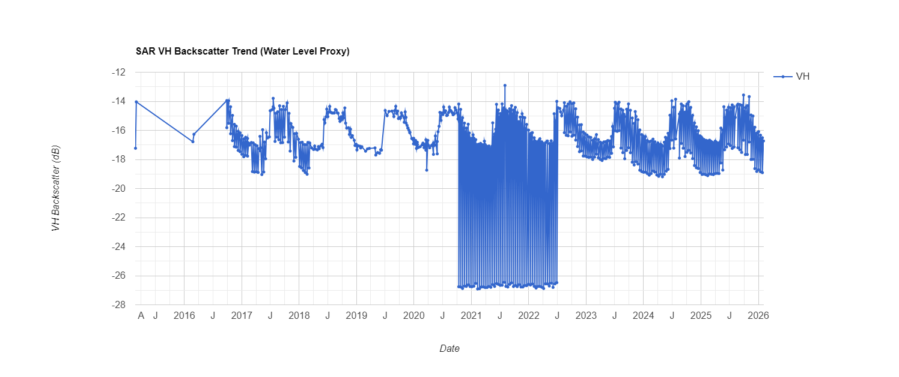

# 🌊 Mahad Flood Mapping 2024 (Sentinel-1 SAR)


**Hydraulic Analysis of the Savitri River Basin Inundation Event (July 2024).**

This repository hosts a robust **Google Earth Engine (GEE)** workflow for mapping flood extents using **Synthetic Aperture Radar (SAR)**. The algorithm utilizes VH polarization change detection to identify inundated areas through heavy monsoon cloud cover, specifically targeting the Mahad region in Raigad, Maharashtra.

---

## 🗺️ Visualization Preview

| **Pre-Flood Baseline** | **Flood Inundation Extent** |
|:---:|:---:|
|  |  |
| *Defined AOI (Red)* | *Detected Anomalies (Yellow)* |

---

## 🛠️ Engineering Methodology

We utilize a **Log-Ratio Change Detection** approach, comparing pre-monsoon baseline backscatter with peak-monsoon acquisitions.

### 📡 The Algorithm
1.  **Data Acquisition**: Sentinel-1 GRD (IW Mode, VH Polarization).
2.  **Preprocessing**: Thermal noise removal & Radiometric calibration ($\sigma^0$).
3.  **Speckle Filtering**: `Focal Median` (50m radius) to smooth SAR grain.
4.  **Topographic Isolation**: **SRTM DEM** slope masking ($< 5^\circ$) to exclude hill shadows and layover effects common in the Western Ghats.
5.  **Thresholding**:
    * **Change Detection**: $\sigma^0_{after} - \sigma^0_{before} < -1.25 \text{ dB}$
    * **Absolute Water**: $\sigma^0 < -18 \text{ dB}$

> **Note:** See [**docs/methodology.md**](docs/methodology.md) for the full hydraulic rationale and equation derivation.

---

## 📉 Results & Hydraulic Insights

* **Total Inundated Area**: `22.516480427401834` (Calculated Peak)
* **Critical Date**: July 25 - July 30, 2024
* **Basin Response**: Rapid saturation observed in the lower Savitri catchment.

### 📅 Time Series Analysis

*The chart above illustrates the basin's "wetting-up" phase and peak discharge proxy based on surface water extent.*

> 🔍 **Deep Dive**: Check [**docs/results.md**](docs/results.md) for detailed statistical breakdowns.

---

## 🚀 How to Run

1.  **Sign Up**: Ensure you have a [Google Earth Engine](https://earthengine.google.com/) account.
2.  **Clone**: Copy the code from `src/flood_mapping.js`.
3.  **Execute**: Paste into the GEE Code Editor and click **Run**.
4.  **Inspect**: Use the `Inspector` tool to click on yellow pixels and view backscatter dB values.

### 💻 Code Snippet (Core Logic)
```javascript
// Hydraulic Change Detection Logic
var ratio = after.subtract(before);
var flood = ratio.lt(-1.25)       // Threshold: -1.25 dB drop
  .and(slopeMask)                 // Exclude steep terrain
  .selfMask();
